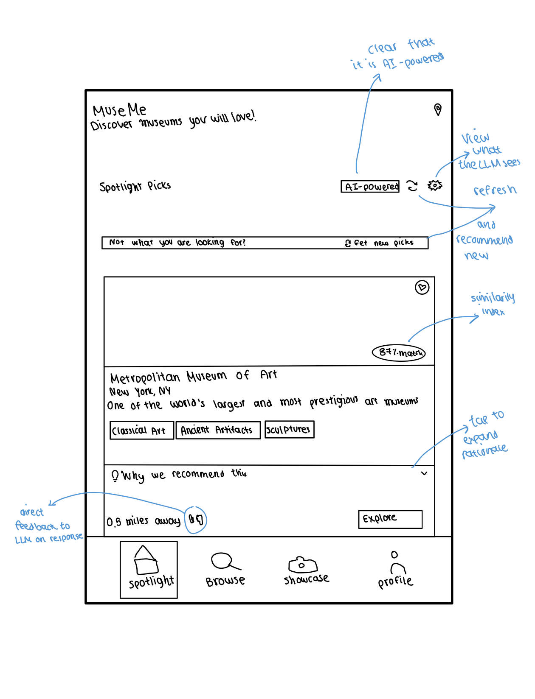
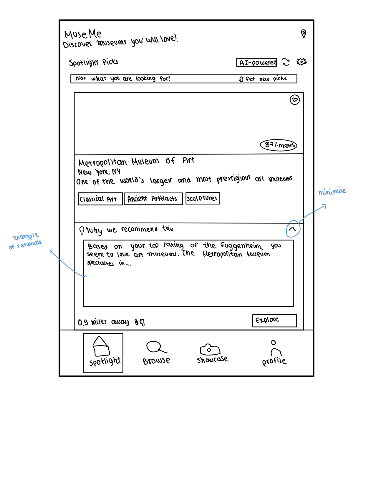
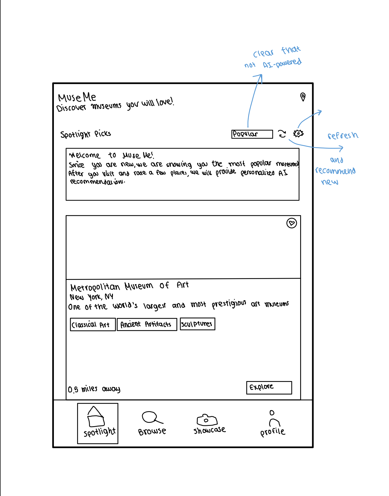
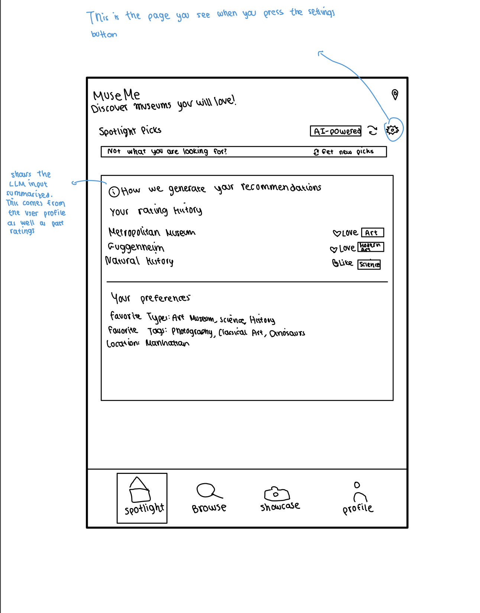
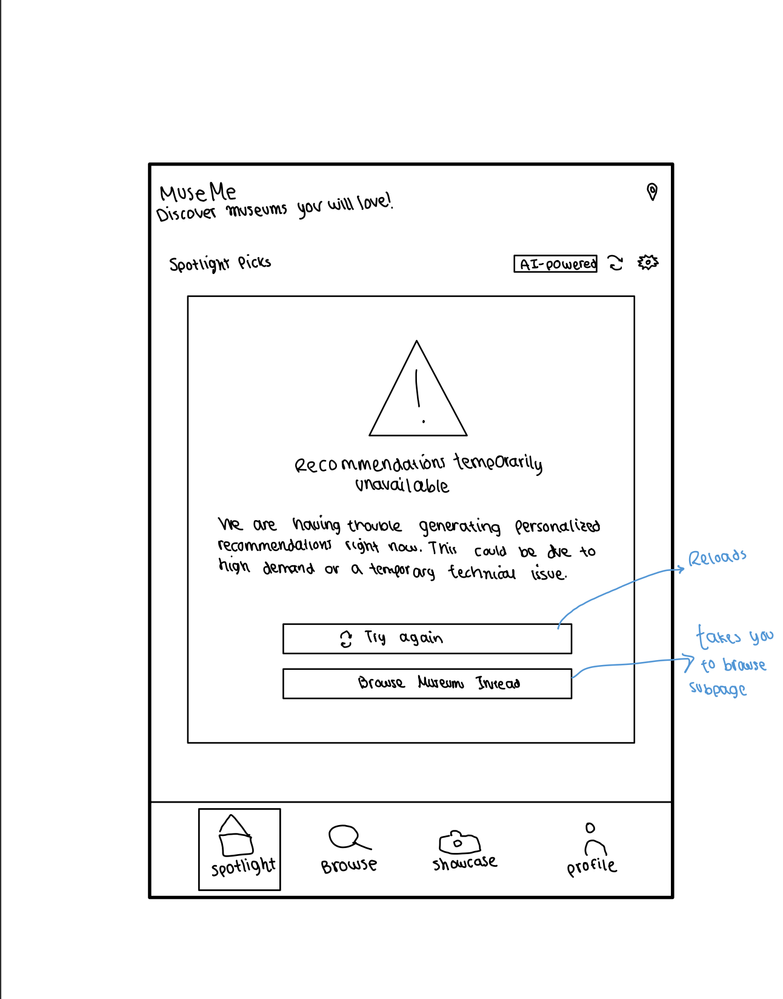
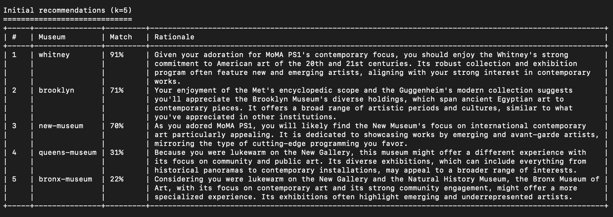

# MuseMe

## Concept: Original

Note that this already included AI actions, but I had left them as a black box. Now, I have edited those actions to be supported by an LLM.

```plaintext
concept Spotlight [User, Museum]

purpose
recommend museums to a user before a visit based on their taste signals

principle
after a user records a few museum tastes (LOVE/LIKE/MEH), the system can return a ranked list of other museums aligned with those tastes; as new signals arrive, future recommendations adapt.

state
a set of TasteSignals with
  a user User
  a museum Museum
  a taste of LOVE or LIKE or MEH
  an updatedAt DateTime

a set of SimilarityLinks with
  a from Museum
  a to Museum
  a similarity Number // higher means more similar
  an updatedAt DateTime

actions
recordMuseumTaste (user: User, museum: Museum, taste: LOVE|LIKE|MEH)
    requires user exists
    effects upsert TasteSignals(user, museum) with taste; set updatedAt := now

clearMuseumTaste (user: User, museum: Museum)
    requires user and TasteSignals(user, museum) exist
    effects delete that TasteSignals

recommendMuseums (user: User, k: Number) : List<Museum>
    requires k ≥ 1
    effects return up to k museums ranked by a black-box recommender that combines the user’s TasteSignals with SimilarityLinks;

system
rebuildSimilarityIndex ()
  effects recompute SimilarityLinks from aggregate community behavior and/or content features;
```

## Concept: AI-Augmented

```plaintext
purpose
  recommend new museums to a user from their historical museum ratings, and produce a concise natural-language rationale for each recommendation

principle
  when a user has a history of museum ratings, the system asks an LLM to analyze those ratings  and to propose a ranked set of new museums with short rationales (e.g., “Similar contemporary sculpture focus to MoMA, which you loved”). As the user’s ratings change, future recommendations and rationales adapt.

state
a set of TasteSignals with
  a user User
  a museum Museum
  a taste of LOVE or LIKE or MEH
  an updatedAt DateTime

  a set of Recommendations with
    a user User
    a museum Museum
    a score Number                            // relative rank score from the LLM output (0..1)
    a rationale String                        // human-readable reason
    a generatedAt DateTime

actions
recordMuseumTaste (user: User, museum: Museum, taste: LOVE|LIKE|MEH)
    requires user exists
    effects upsert TasteSignals(user, museum) with taste; set updatedAt := now

clearMuseumTaste (user: User, museum: Museum)
    requires user and TasteSignals(user, museum) exist
    effects delete that TasteSignals

  llmRecommend (user: User, k: Number) : List<(museum: Museum, rationale: String)>
    requires k ≥ 1 and TasteSignals(user) not empty
    effect calls an LLM with a prompt containing:
           - the user’s MuseumRatings (LOVE/LIKE/MEH and optional avgStars)
           The LLM returns up to k museums not already rated by the user, each with a short rationale and a score.
           Replace Recommendations for (user) with the returned set; set generatedAt := now for each;

system
  refreshOnRatingChange (user: User)
    requires TasteSignals changed for user within a debounce window
    effects call llmRecommend(user, k := implementation default)

query
getRecommendations (user: User, k: Number) : List<(museum: Museum, rationale: String)>
  requires k ≥ 1
  effects return the top-k rows from Recommendations for user by score, most recent generatedAt; no LLM call

```

## Sketches

### Main LLM-powered recommendations


### LLM-powered rationale for recommendation


### No data, no LLM output


### Input to LLM


### Error handling


## User-journey

As a brand-new user, Maya opens MuseMe and lands on **Spotlight** showing a neutral “Popular” starter list (view no data sketch): no ratings yet, so the header chip reads “Popular,” and she scrolls curated staples. After her first outing, she logs a visit and stars a few exhibits (not pictured here). The next time she returns to **Spotlight**, the header now reads **“AI Powered”** and cards display a match badge (e.g., *87% match*) as in the primary Spotlight Picks mock. Curious, she taps **“Why we recommend this”** on a card to reveal the short rationale that cites her past ratings (see rationale sketch). She really likes the recommendaiton of the Natural History museum so she clicks the thumbs up button and saves the musuem by adding it to her favorites. Next time, the LLM will take into account that she enjoyed that recommendation. To understand what the AI is using, she taps the settings/info icon, opening the **“How We Generate Your Recommendations”** panel that lists her **Rating History** and **Preferences** (see input sketch). Wanting a few more options, she taps **Get new picks** to refresh the list. Unfortunately, the AI service is briefly unavailable; the **Recommendations Temporarily Unavailable** card appears (see error state sketch), offering **Try Again** or **Browse Museums Instead**. She decides to tap **Try Again**, and the personalized list returns with rationales she can expand as needed.


## Prerequisites

- **Node.js** (version 14 or higher)
- **TypeScript** (will be installed automatically)
- **Google Gemini API Key** (free at [Google AI Studio](https://makersuite.google.com/app/apikey))

## Quick Setup

### 0. Clone the repo locally and navigate to it
```cd assignment3```

### 1. Install Dependencies

```bash
npm install
```

### 2. Add Your API Key

**Why use a template?** The `config.json` file contains your private API key and should never be committed to version control. The template approach lets you:
- Keep the template file in git (safe to share)
- Create your own `config.json` locally (keeps your API key private)
- Easily set up the project on any machine

**Step 1:** Copy the template file:
```bash
cp config.json.template config.json
```

**Step 2:** Edit `config.json` and add your API key:
```json
{
  "apiKey": "YOUR_GEMINI_API_KEY_HERE"
}
```

**To get your API key:**
1. Go to [Google AI Studio](https://makersuite.google.com/app/apikey)
2. Sign in with your Google account
3. Click "Create API Key"
4. Copy the key and paste it into `config.json` (replacing `YOUR_GEMINI_API_KEY_HERE`)

### 3. Run the Application

**Run all test cases:**
```bash
npm start
```

**Run specific test cases:**
```bash
npm run manual    # Manual scheduling only
npm run llm       # LLM-assisted scheduling only
npm run mixed     # Mixed manual + LLM scheduling
```

## File Structure

```
dayplanner/
ASSIGNMENT3/
├─ package.json                 # NPM scripts (build/start), deps incl. @google/generative-ai
├─ package-lock.json            # Exact dependency versions (auto-generated)
├─ tsconfig.json                # TypeScript config (targets Node, emits to dist/)
├─ README.md                    # Project overview & how to run tests
├─ config.json                  # Local secrets (Gemini API key)
├─ gemini-llm.ts                # LLM wrapper (timeouts, retries, idempotent cache)
├─ spotlight-ai.ts              # Spotlight concept logic + validators + prompt builder
├─ spotlight-tests.ts           # Test cases & printer for console tables
├─ spotlight.spec               # Spec notes for the Spotlight concept
├─ sketches/                    # UI sketches referenced in the write-up
│   ├─ error.png                      # (PNG/JPG/PDF files)
│   ├─ input.png                      # (PNG/JPG/PDF files)
│   ├─ main.png                      # (PNG/JPG/PDF files)
│   ├─ output.png                      # (PNG/JPG/PDF files)
│   ├─ popular.png                      # (PNG/JPG/PDF files)
│   ├─ rationale.png                      # (PNG/JPG/PDF files)
├─ dist/                        # Compiled JavaScript output (tsc -> dist)│
└─ node_modules/                # Installed packages (auto-generated)
```

## Test Cases

Test Cases
The application includes three comprehensive test cases that exercise the final Spotlight prompt and concept actions.

### 1. Cold Start → First Taste → AI Recommendations
Demonstrates the cold-start fallback (no recommendations), then adding the user’s first museum rating and requesting AI recommendations.

### 2. Richer Taste Profile → Refresh On Rating Change
Shows a fuller profile across multiple museums, then updates a rating and triggers a refresh to get updated AI recommendations.

### 3. LLM Outage Handling
Simulates an LLM failure to validate error handling and the fallback path.

## Sample Output



### Experiment summaries

**Experiment 1**
 Verified the cold-start path (no TasteSignals ⇒ empty result set; UI falls back to Popular). Then added a single strong rating and requested top-3 using the prompt with baseline clarity rules (A) and the final JSON format.
 - What worked: After the first rating, recommendations referenced the rated museum by name and returned valid JSON; explanations were concise.
 - What went wrong: With only one positive signal, scores were tightly bunched and rationales sometimes repeated the same justification.
 - Issues remaining: Consider a minimum-history threshold (e.g., require at least two distinct positive signals) or a simple diversity heuristic outside the concept to reduce near-duplicates.

**Experiment 2**
Richer taste profile + refreshOnRatingChangeApproach: Seeded a broader profile spanning encyclopedic, modern/architecture, experimental contemporary, old masters, manuscripts, and one low-interest domain; requested top-5 with the humanized language + concrete attributes rules (B) and the match-based scoring rubric (C). Upgraded one museum from “positive” to “strong” and triggered refreshOnRatingChange.
- What worked: Rankings shifted appropriately toward contemporary/experimental picks; rationales used natural phrasing (no raw labels) and frequently cited concrete attributes such as “postwar sculpture” or “rotating photography shows.” JSON stayed valid.
- What went wrong: A few rationales omitted citing a prior museum even when it could have strengthened the explanation.
- Issues remaining: Add a validator that flags rationales missing a prior-museum citation; optionally re-prompt or keep the previous rationale if validation fails.

**Experiment 3**
 Simulated an LLM outage with a throwing wrapper; verified error propagation and fallback guidance (Popular/Browse/Retry) while preserving the last good Recommendations. Final prompt rules (including no location mentions and JSON-only output) are unaffected when service resumes.
 - What worked: Failure surfaced cleanly; cached results prevented UI flicker; the retry path is straightforward.
 - What went wrong: If failures trigger a full clear of Recommendations, the UI can look empty; retaining cache avoids this.
 - Issues remaining: Add retry with exponential backoff and a user-facing cooldown; log a correlation id for observability.


## Prompt evolution
Final prompt (summary of rules actually used in code):
- Inputs: user’s TasteSignals (LOVE/LIKE/MEH) and a set of candidate museums.
- Exclude already-rated museums.
- Compute a numeric score ∈ [0,1] per candidate (the LLM returns it). The prompt specifies a match-based rubric that weights tastes (LOVE=1.0, LIKE=0.6, MEH=0.2) and asks the model to estimate similarity against rated museums, apply a soft penalty for resemblance to MEH, and clamp the result.
- Rationale: 2-3 sentences, begins with “(NN% match) ” where NN = round(score×100), avoids the literal words LOVE/LIKE/MEH, avoids location mentions, cites at least one rated museum when possible, and includes a concrete collection/program attribute when known (no inventing facts).
- Output: strict JSON { "recommendations": [ { museumId, score, rationale } ] }.

1. **Variant A** (baseline)
- Motivated by Test 1: cold start → first taste
- Problem observed: with only one positive signal, early rationales were generic.
- Prompt change: require 2-3 sentences and cite at least one rated museum by name when explaining why a candidate fits; explicitly exclude already-rated museums; request strict JSON.
- Effect: clearer, more grounded explanations after the first rating.

```plaintext
You are a museum recommendation assistant.

Select up to K museums from CANDIDATES that best match the user's TASTE_SIGNALS.
Do NOT include any museum already present in TASTE_SIGNALS.

Explanations:
- For each recommendation, write a concise rationale of 2-3 sentences.
- When possible, cite at least one rated museum by name to explain the match.

Output:
Return ONLY valid JSON in exactly this shape (no extra prose, no trailing commas):
{
  "recommendations": [
    { "museumId": "<string-from-CANDIDATES>", "score": <number between 0 and 1>, "rationale": "<= 2 sentences>" }
  ]
}

TASTE_SIGNALS (JSON):
{{TASTE_SIGNALS_JSON}}

CANDIDATES (JSON array of museumIds):
{{CANDIDATES_JSON}}
```

2. **Variant B** (humanized language + concrete attributes)
- Motivated by Test 2: richer profile + refresh
- Problem observed: rationales sometimes echoed raw labels (“LOVE/LIKE/MEH”) and were light on substance.
- Prompt change: forbid the literal labels in the rationale (use natural phrasing like “you adored / you enjoyed / you were lukewarm on”); require at least one concrete museum attribute (e.g., “postwar sculpture focus,” “rotating contemporary photography shows”) when known; keep the JSON constraint.
- Effect: more persuasive, content-based rationales; better differentiation across similar candidates.

```plaintext
You are a museum recommendation assistant.

Select up to K museums from CANDIDATES that best match the user's TASTE_SIGNALS.
Do NOT include any museum already present in TASTE_SIGNALS.

Explanations (very important):
- For each recommendation, write a concise rationale of 2-3 sentences.
- Do NOT use the literal words “LOVE”, “LIKE”, or “MEH” in the rationale; use natural phrasing (e.g., “you adored”, “you enjoyed”, “you were lukewarm on”).
- When possible, cite at least one rated museum by name to explain the match.
- Include at least one concrete attribute or program characteristic when known (e.g., “postwar sculpture focus”, “rotating contemporary photography shows”). Do NOT invent facts.

Output:
Return ONLY valid JSON in exactly this shape (no extra prose, no trailing commas):
{
  "recommendations": [
    { "museumId": "<string-from-CANDIDATES>", "score": <number between 0 and 1>, "rationale": "<= 2 sentences, human phrasing, with concrete attribute if known>" }
  ]
}

TASTE_SIGNALS (JSON):
{{TASTE_SIGNALS_JSON}}

CANDIDATES (JSON array of museumIds):
{{CANDIDATES_JSON}}
```

3. **Variant C** (match-based scoring rubric)
- Motivated by Tests 1–2
- Problem observed: LLM scores could cluster or lack a principled basis.
- Prompt change: add an explicit scoring rubric, instead of generic LLM score: map tastes to weights (1.0/0.6/0.2), estimate candidate↔rated similarities in [0,1] by collections/era/medium/program, compute a weighted average, soft-penalize resemblance to MEH, clamp to [0,1], and rank by score. Keep rationale rules from A/B and forbid location mentions (location already appears in the card UI, so it is repetitive).
- Effect: more stable, interpretable scores; rationales remain concise and focused on substance.


```plaintext
You are a museum recommendation assistant.

Task:
- Select up to K museums from CANDIDATES that best match the user's TASTE_SIGNALS.
- Do NOT include any museum already present in TASTE_SIGNALS.

Scoring rubric (must follow):
1) Map tastes to weights:
   LOVE → 1.0
   LIKE → 0.6
   MEH  → 0.2
2) For each candidate, estimate a similarity in [0,1] to each rated museum using known characteristics:
   collections/era/medium/program (e.g., contemporary, postwar sculpture, photography, old masters, experimental).
   If uncertain, keep similarity modest (≤ 0.5). Do NOT invent facts.
3) Compute raw match:
   raw = ( Σ_i weight(taste_i) * similarity(candidate, rated_i) ) / ( Σ_i weight(taste_i) )
4) Penalize strong resemblance to low-interest museums:
   let maxMEH = max similarity to any museum the user was lukewarm on (MEH).
   final = raw - 0.3 * max(0, maxMEH - 0.6)
5) Clamp final to [0,1]; use this as "score".
6) Rank candidates by score (desc) and return the top K.

Rationale policy (very important):
- For each recommendation, write a concise rationale of at most 2 sentences.
- Begin the rationale with "(NN% match) " where NN = round(score * 100).
- Do NOT use the literal words “LOVE”, “LIKE”, or “MEH”; use natural phrasing (e.g., “you adored”, “you enjoyed”, “you were lukewarm on”).
- Do NOT mention location or neighborhood in the rationale.
- When possible, cite at least one rated museum by name, and include a concrete attribute/program characteristic if known. Do NOT invent facts.

Output (strict JSON only; no prose, no trailing commas):
{
  "recommendations": [
    { "museumId": "<string-from-CANDIDATES>", "score": <number between 0 and 1>, "rationale": "<starts with (NN% match), <= 2 sentences>" }
  ]
}

TASTE_SIGNALS (JSON):
{{TASTE_SIGNALS_JSON}}

CANDIDATES (JSON array of museumIds):
{{CANDIDATES_JSON}}
```

## Validators

### 1. Hallucinated or duplicate museums.
* The LLM might recommend a museum that isn’t in the current candidate pool (or one the user already rated), or repeat the same museum twice.
* Validator: Check each museumId is in unseen (candidates minus already-rated), and enforce no duplicates.

### 2. Invalid or inconsistent scores.
* The model might return a score outside [0,1] or a rationale whose “(NN% match)” doesn’t match the numeric score (e.g., says 95% but score=0.62).
* Validator: Enforce 0 ≤ score ≤ 1, require a leading "(NN% match) " in the rationale, and verify |NN − round(score*100)| ≤ 10 (tolerance).

### 3. Rationale rule violations.
* The model may include disallowed phrasing (raw “LOVE/LIKE/MEH”), exceed the 3-sentence limit, or produce empty/low-content text.
* Validator: Reject rationales that contain the literal words LOVE|LIKE|MEH (as standalone words), exceed 3 sentences (split on .?!), or are missing non-whitespace content after the percent prefix.

## LLM Preferences (Hardwired)

The AI uses these built-in preferences:
- Inputs: user TasteSignals (LOVE/LIKE/MEH), candidates (eligible museum IDs), k top-N.
- Scoring rubric: LOVE=1.0, LIKE=0.6, MEH=0.2; estimate similarity (0..1) to each rated museum by collections/era/medium/program;
- score = (Σ weight*t similarity) / (Σ weight) with a soft penalty for high similarity to any MEH; clamp to [0,1].

## Troubleshooting

### "Could not load config.json"
- Ensure `config.json` exists with your API key
- Check JSON format is correct

### "Error calling Gemini API"
- Verify API key is correct
- Check internet connection
- Ensure API access is enabled in Google AI Studio

### Build Issues
- Use `npm run build` to compile TypeScript
- Check that all dependencies are installed with `npm install`

## Next Steps

Try extending Spotlight:
* Add batch recommendations (top-N with pagination) and “show more/refresh” UX
* User controls: hide/ban a museum, thumbs-up/down a recommendation to fine-tune
* Candidate sourcing: city/collection filters; exclude already-rated; time-boxed exhibitions
* Privacy: strip PII from prompts; cap taste history length; configurable retention
* UI polish: expandable rationale, and “why recommended” panel

## Resources

- [Google Generative AI Documentation](https://ai.google.dev/docs)
- [TypeScript Documentation](https://www.typescriptlang.org/docs/)
